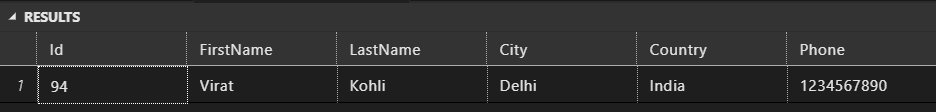

# Store Procedure
> Created By:   Asad Ahmed \
> Created Date: 13/09/2023

- Stored Procedure is a set of SQL statements that are stored in the database in compiled form so that it can be shared by a number of programs.
- Stored Procedure is a function consists of many SQL statement to access the database system.
- Several advantages of using stored procedures are:
    - **Modularity**: You can create the stored procedure once, store it in the database, and call it any number of times in your program.
    - **Security**: You can grant appropriate permissions to users so that they can access database objects without having to know the underlying SQL statements.
    - **Reduced traffic**: If network bandwidth is the bottleneck in the performance of your application, you can reduce the traffic by executing SQL statements in stored procedures in the database.
    - **Improved performance**: Stored procedures are precompiled. Therefore, the performance is usually better.
    - **Reduced development cost and increased reliability**: Once created, stored procedures can be used by any number of client programs of any type. Therefore, you need to develop and debug the code only once.

## Creating Stored Procedure
- Syntax:
```sql
CREATE PROCEDURE procedure_name
AS
sql_statement
```
- Example:
```sql
CREATE PROCEDURE GetCustomer
AS 
BEGIN
    SELECT * FROM Customers
END
```
- Execute:
```sql
EXEC GetCustomer
```
- Example:
```sql
-- Store Procedure

CREATE PROCEDURE GetCustomers AS 
BEGIN
SELECT  FirstName            AS FName
       ,LastName             AS LName
       ,City + ',' + Country AS [Location]
       ,Phone                AS Mobile
FROM Customer END
```
- Execute:
```sql
EXEC GetCustomers
```
## Parameterized Stored Procedure
- Syntax:
```sql
CREATE PROCEDURE procedure_name
@parameter1 datatype,
@parameter2 datatype,
...
AS
sql_statement
```
- CREATE PROCEDURE InsertCustomer:
```sql

CREATE PROCEDURE InsertCustomer
    @FirstName VARCHAR(50)
    ,@LastName VARCHAR(50)
    ,@City VARCHAR(50)
    ,@Country VARCHAR(50)
    ,@Phone VARCHAR(50)
AS
BEGIN
    INSERT INTO Customer
    VALUES (
        @FirstName
        ,@LastName
        ,@City
        ,@Country
        ,@Phone
        )
END
```
- Note: @FirstName, @LastName, @City, @Country, @Phone are parameters
- Note: VARCHAR(50) is datatype
### Important: You have to execute the stored procedure before you can use it.

- Exec InsertCustomer 'Babar','Azam','Lahore','Pakistan','1234567890'
```sql
EXEC InsertCustomer 'Babar','Azam','Lahore','Pakistan','1234567890'
```
Now we have only created the stored procedure and stored only one record in the database. what if we want to get an id of the record we have just inserted. For this purpose we have to use OUTPUT parameter.
- Syntax:
```sql
ALTER PROCEDURE InsertCustomer
    @FirstName VARCHAR(50)
    ,@LastName VARCHAR(50)
    ,@City VARCHAR(50)
    ,@Country VARCHAR(50)
    ,@Phone VARCHAR(50)
AS
BEGIN
    INSERT INTO Customer
    VALUES (
        @FirstName
        ,@LastName
        ,@City
        ,@Country
        ,@Phone
        )
        DECLARE @Id AS INT -- declaring id as int
        SET @Id = @@IDENTITY -- here we are setting the value of @Id to the id of the record we have just inserted
        SELECT * FROM Customer WHERE Id = @Id -- here we are returning the value of @Id
END
```
- @@IDENTITY is a system function that returns the last-inserted identity value.
- It will return the id of the record we have just inserted. see below:
- insert another record to check the identity
```sql
Exec InsertCustomer 'Virat', 'Kohli', 'Delhi', 'India', '1234567890'
```
- Output:


## Alter Stored Procedure & Add Id Variable

- Description:  This procedure returns customer information
- This code returns the details of all the customers in the Customer table if no parameter is passed.
- If the Id parameter is passed then it returns the details of the customer with Id equal to the parameter value.

- Syntax:
```sql
ALTER PROCEDURE GetCustomers 
@Id AS INT = NULL
AS 
BEGIN
    /* If @Id is not null */
    IF @Id IS NOT NULL
        BEGIN
            /* Select the details of the customer with Id equal to @Id */
            SELECT  FirstName            AS FName
                ,LastName             AS LName
                ,City + ',' + Country AS [Location]
                ,Phone                AS Mobile
            FROM Customer 
            WHERE Id = @Id
        END
    ELSE
        BEGIN
            /* Else select the details of all the customers */
            SELECT  FirstName            AS FName
                ,LastName             AS LName
                ,City + ',' + Country AS [Location]
                ,Phone                AS Mobile
            FROM Customer
        END
END
```

- Execute GetCustomers
```sql
Exec GetCustomers 92
```
- Output:


- Execute GetCustomers without parameter id (NULL)
```sql
Exec GetCustomers
```
- Output:
- It will return all the records in the database
- NULL is the default value of the parameter id
- Note: If you want to change the default value of the parameter id then you have to change the value of the parameter id in the stored procedure.

